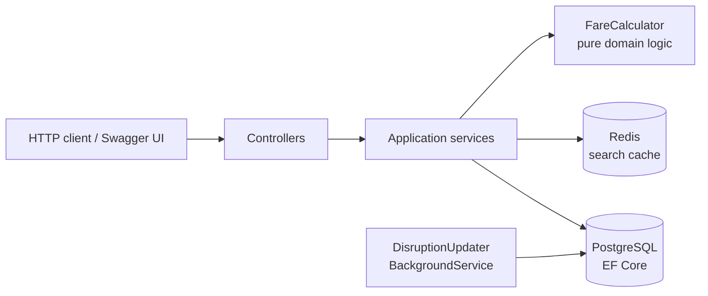

# Rail Journey & Booking API

A REST API for searching rail services, pricing tickets and booking seats — built with
ASP.NET Core 8, Entity Framework Core and PostgreSQL, with Redis caching, a hosted
background worker, unit and integration tests, and a containerised local stack.

The domain is deliberately realistic rather than a toy CRUD app: fares depend on
peak/off-peak time bands, how far ahead the ticket is bought and whether the passenger
holds a railcard, and seat availability has to hold up under concurrent bookings.

---

## Architecture



Layering is conventional and deliberate:

| Layer | Responsibility |
|---|---|
| `Controllers` | HTTP concerns only — binding, status codes, problem details |
| `Services` | Business rules: search, pricing, booking |
| `Data` | `DbContext`, model configuration, seeding |
| `Models` / `Dtos` | Persistence entities vs. the API contract, kept separate |

`FareCalculator` is pure: no database, no clock, no I/O. Everything it needs is passed in.
That is what makes the pricing rules cheap to test exhaustively.

---

## Endpoints

| Method | Route | Description |
|---|---|---|
| `GET` | `/api/stations?search=` | List / filter stations |
| `GET` | `/api/journeys?from=EUS&to=CAR&date=2026-08-05&railcard=false` | Search services with fares and seat availability |
| `POST` | `/api/bookings` | Book seats, returns a booking reference |
| `GET` | `/api/bookings/{reference}` | Retrieve a booking |
| `GET` | `/health` | Liveness probe |

Swagger UI is served at `/swagger` in Development.

### Example

```bash
curl "http://localhost:8080/api/journeys?from=EUS&to=CAR&date=2026-08-05"

curl -X POST http://localhost:8080/api/bookings \
  -H "Content-Type: application/json" \
  -d '{
        "serviceCode": "EUSCAR1215",
        "travelDate": "2026-08-05",
        "passengerName": "Q Zheng",
        "passengerCount": 2,
        "hasRailcard": true
      }'
```

---

## Fare rules

Applied in order, multiplicatively:

1. **Time band** — weekday departures 06:30–09:29 and 16:00–18:59 are peak (full fare);
   everything else, including all weekend travel, is off-peak (×0.70).
2. **Advance purchase** — booked 14+ days ahead ×0.60, 7–13 days ahead ×0.80,
   otherwise full price.
3. **Railcard** — one third off (×2/3).
4. A minimum fare of £1.00 applies, and the result is rounded to the nearest penny.

Every rule and every boundary condition is covered in `FareCalculatorTests`.

---

## Running it

### With Docker (recommended)

```bash
docker compose up --build
```

Then open <http://localhost:8080/swagger>. The database is created and seeded with ten
UK stations and their services on first start.

### Locally

Requires .NET 8 SDK, plus PostgreSQL and Redis on their default ports:

```bash
dotnet run --project src/RailApi
```

### Tests

```bash
dotnet test tests/RailApi.Tests/RailApi.Tests.csproj
```

Unit tests cover the fare engine; the search-service tests run against in-memory SQLite,
so the LINQ genuinely has to translate to SQL rather than being evaluated in the client.

---

## Design notes

**Redis is a cache, not a dependency.** The connection uses `abortConnect=false` and every
read and write is wrapped in a guard: if Redis is unavailable the API degrades to hitting
PostgreSQL rather than returning errors. Search results are cached for 60 seconds.

**Seat availability uses a serialisable transaction.** Reading the remaining seats and
inserting the booking must be atomic, otherwise two concurrent requests can both see the
last seat and oversell it.

**Seat counts are one grouped query, not one query per service.** The obvious
implementation of the search endpoint issues an availability query per result — a classic
N+1. `JourneySearchService` fetches all counts in a single `GROUP BY`.

**`TimeProvider` is injected rather than calling `DateTime.UtcNow`.** Pricing and
"has this train already left?" both depend on the current time, so the clock is a
dependency like any other and tests substitute a fixed one.

**Logging is structured.** Serilog writes compact JSON to stdout, which is what a log
pipeline such as ELK expects to ingest.

**Schema is managed with EF Core migrations.** The database schema is managed with EF Core migrations, applied automatically on startup via `Database.Migrate()`. Schema changes (such as adding a column) are captured as migrations and applied to the existing database without data loss, rather than recreating it.


---

## What I would add before calling this production-ready


- **Authentication and authorisation** on the booking endpoints, and rate limiting on search.
- **Idempotency keys** on `POST /api/bookings`, so a client retry after a timeout cannot
  produce a duplicate booking.
- **Pagination** on the journey search response.
- **Observability**: OpenTelemetry traces across the HTTP, EF and Redis calls; metrics on
  cache hit rate, search latency and booking failure reasons.
- **Resilience policies** (Polly) around outbound calls once real operator feeds replace
  the seeded data.
- **Read/write separation or optimistic concurrency** on `TrainService` — the background
  updater currently writes to rows the search path reads.

---

## Project layout

```
.
├── src/RailApi/
│   ├── Controllers/          HTTP endpoints
│   ├── Services/             Search, booking, fare calculation
│   ├── BackgroundServices/   Periodic disruption updater
│   ├── Data/                 DbContext, model config, seeding
│   ├── Models/               EF entities
│   ├── Dtos/                 API contracts (records)
│   └── Program.cs            DI wiring and pipeline
├── tests/RailApi.Tests/
├── .github/workflows/ci.yml  Build, test, docker image
├── Dockerfile
└── docker-compose.yml
```
